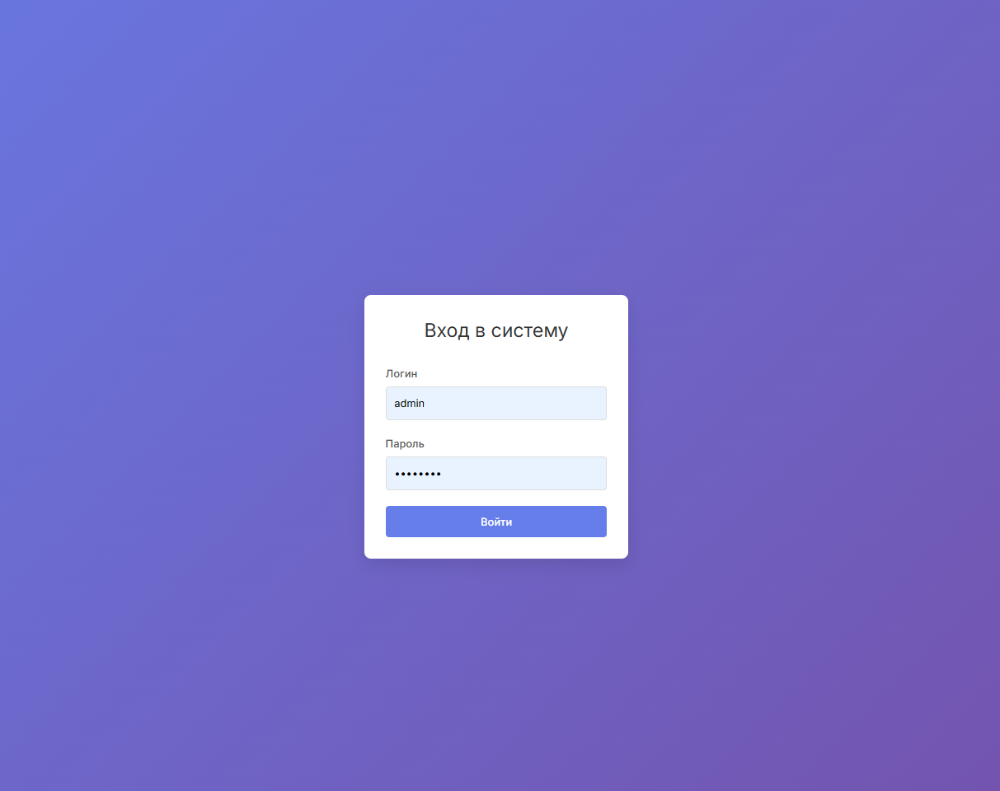
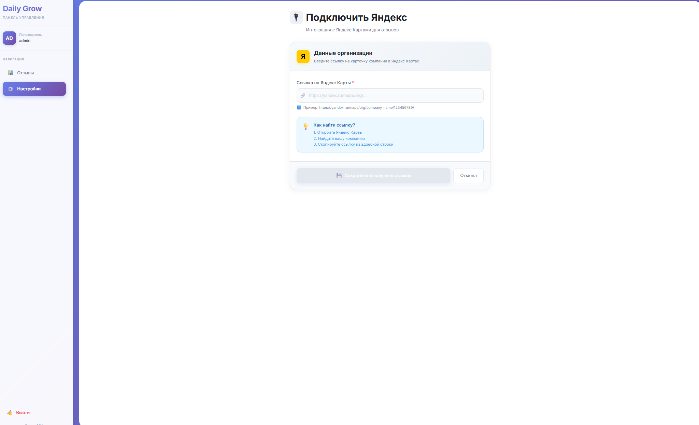
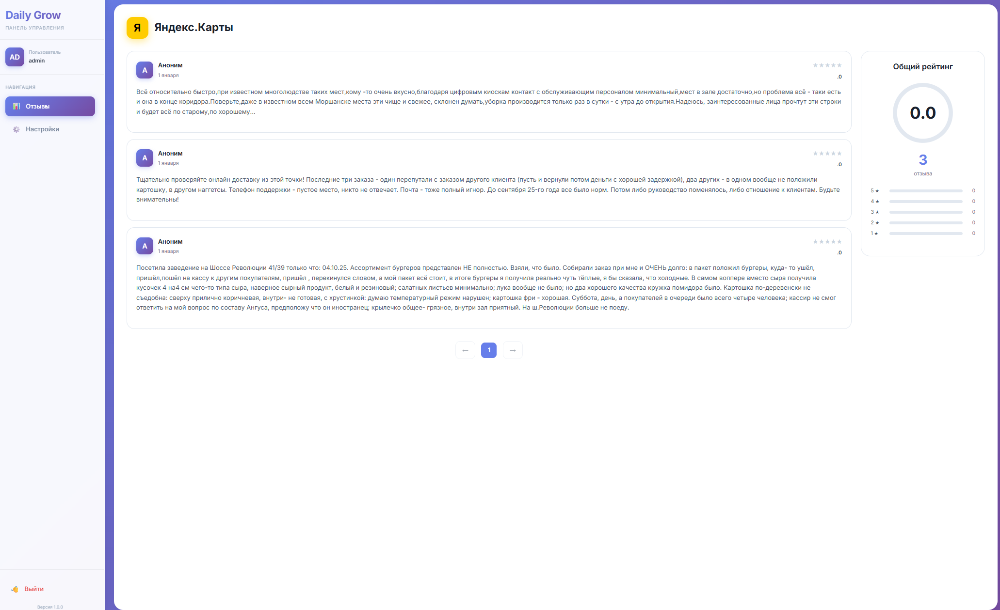

# Двухстраничный проект интеграция с Яндекс Картами

## Инструкция пользователя:

1) Авторизируетесь (логин: admin, пароль: admin123).
2) Переходите в Яндекс Карты и копируете адрес организации (тестировалось на "Бургер кинг").
3) Вводиет ссылку в поле старницы настроек и нажимаете "Сохранить и получать отзывы".
4) Переходитен на страницу с отзывами и видите их.

## Для запуска локально

```sh
npm install
```

```sh
npm run build
```

```sh
php artisan serve
```

## Скрины интерфейса:






